# INVESTRA GOVERMENT — Dokumentasi UML

---

## 1. Arsitektur Sistem

> **Keterangan:** Arsitektur sistem terdiri dari 4 layer. **Client** mengakses sistem melalui browser. **Frontend** (React SPA, port 3000) menangani routing, state management (Zustand + sessionStorage), dan UI (Radix UI + Recharts). **Backend** (Flask API, port 5000) mengelola middleware keamanan (JWT, RBAC, Rate Limiter, CORS), controller, dan service analisis. **Data Layer** menggunakan PostgreSQL 16 untuk penyimpanan dan Redis 7 untuk rate limiting.

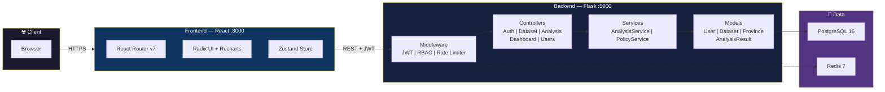

---

## 2. Use Case Diagram

> **Keterangan:** Use case diagram menampilkan 3 aktor: **User** (akses landing page dan login), **Admin** yang mewarisi User dan memiliki akses ke seluruh fitur analisis data, serta **Superadmin** yang memiliki fitur manajemen sistem. Relasi `<<include>>` menunjukkan use case yang wajib dijalankan (contoh: Jalankan K-Means wajib include Jalankan PCA, yang wajib include Preprocessing Data). Relasi `<<extend>>` menunjukkan fitur opsional (contoh: Tentukan Jumlah Cluster memperluas Jalankan K-Means).

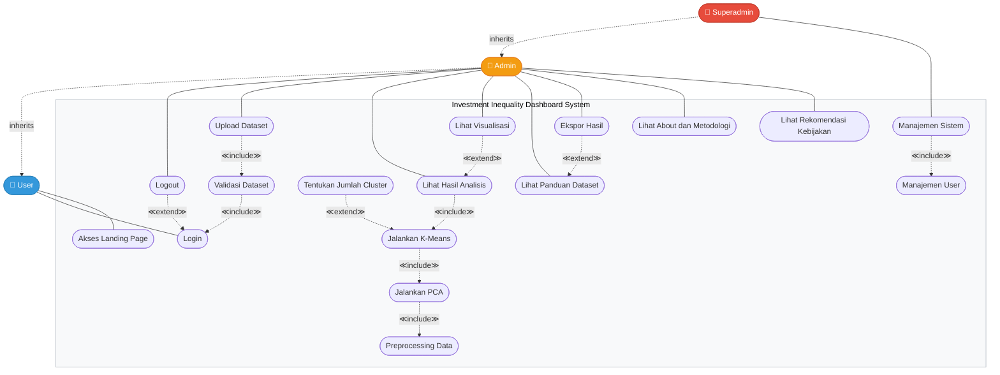

---

## 3. Activity Diagram

### 3.1 Login

_Ref: Use Case — Login_

> **Keterangan:** User menginput kredensial, sistem memvalidasi username dan password terhadap database. Jika valid, dicek status akun aktif. Token JWT (HS256, 12 jam) di-generate dan disimpan ke Zustand Store + sessionStorage. Terdapat 2 titik kegagalan: kredensial salah (dapat diulang) dan akun nonaktif (berhenti).

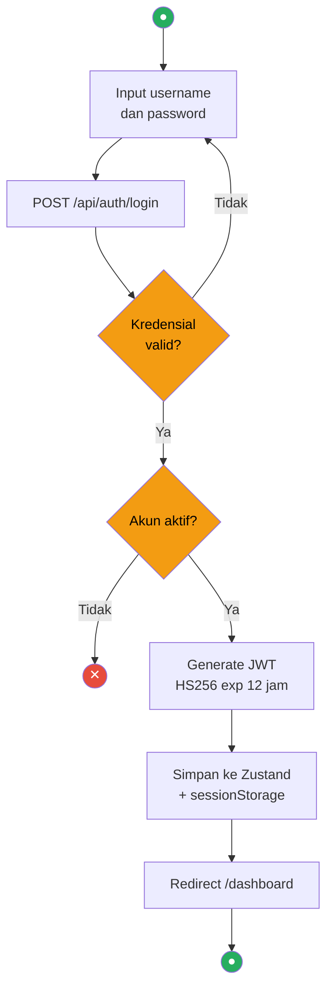

### 3.2 Upload Dataset

_Ref: Use Case — Upload Dataset `<<include>>` Validasi Dataset_

> **Keterangan:** Admin memilih file CSV lalu mengirimkan ke API. Proses **Validasi Dataset** (`<<include>>`) dilakukan dengan 3 tahap: otorisasi JWT + role, kelengkapan kolom wajib (provinsi, pmdn_rp, fdi_rp, ipm, kemiskinan, pdrb, tpt, akses_listrik), dan deteksi duplikasi melalui checksum SHA-256. Jika lolos, sistem membuat versi baru, menonaktifkan versi lama, meng-insert data provinsi, dan mengaktifkan dataset baru.

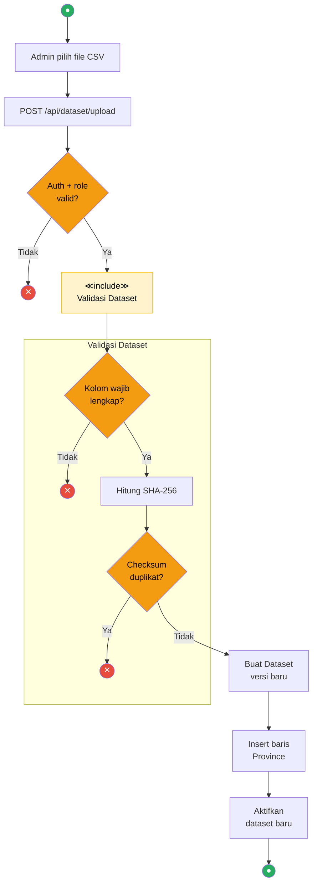

### 3.3 Lihat Hasil Analisis

_Ref: Use Case — Lihat Hasil Analisis `<<include>>` Jalankan K-Means `<<include>>` Jalankan PCA `<<include>>` Preprocessing Data_

> **Keterangan:** Ini adalah alur inti sistem yang mencakup pipeline lengkap. Admin menentukan parameter, sistem memuat data, lalu secara berurutan menjalankan **Preprocessing** (log-transform + StandardScaler), **PCA** (reduksi dimensi), dan **K-Means** (Consensus 25 runs × n_init=50). Hasil evaluasi (Silhouette, Inertia, Davies-Bouldin, Calinski-Harabasz) disimpan ke database, lalu ditampilkan kepada admin.

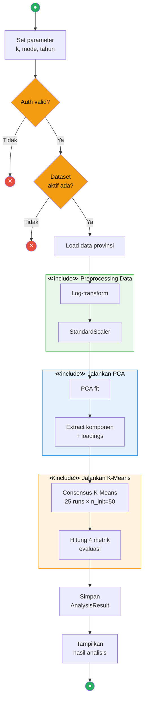

### 3.4 Lihat Rekomendasi Kebijakan

_Ref: Use Case — Lihat Rekomendasi Kebijakan_

> **Keterangan:** Sistem mengambil hasil analisis terakhir, menghitung **rata-rata nasional** per indikator, membandingkan tiap cluster dengan rasio terhadap nilai nasional. Rasio diklasifikasikan ke 5 level (Sangat Rendah–Sangat Tinggi). Selanjutnya dilakukan interpretasi PCA loadings dan **rule engine** menghasilkan arah kebijakan spesifik per cluster.

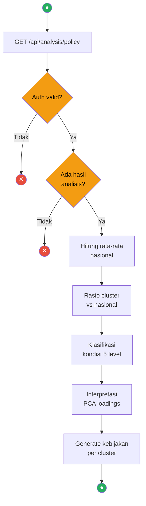

### 3.5 Manajemen User

_Ref: Use Case — Manajemen Sistem `<<include>>` Manajemen User_

> **Keterangan:** Superadmin dapat melakukan 3 aksi: **Create** (validasi password strength, cek duplikat username/email, generate UUID, hash password), **Update** (proteksi: tidak bisa downgrade/nonaktifkan last superadmin), dan **Delete** (proteksi: tidak bisa hapus last active superadmin). Setiap aksi memerlukan autentikasi dan role superadmin.

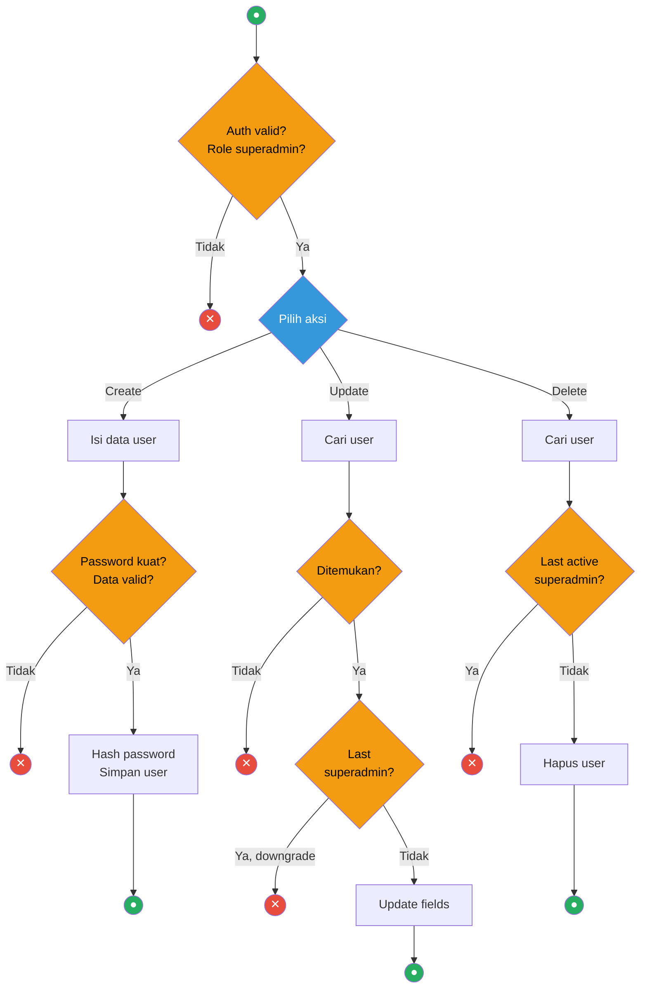

---

## 4. Sequence Diagram

### 4.1 Login

_Ref: Use Case — Login_

> **Keterangan:** User mengirim kredensial ke Frontend → POST ke Flask API → query PostgreSQL → verify password hash → generate JWT → simpan ke Zustand + sessionStorage → redirect. Pada akses berikutnya, token dikirim sebagai Bearer header untuk validasi di Middleware.

```mermaid
sequenceDiagram
    actor User
    participant FE as Frontend
    participant ZS as Zustand Store
    participant MW as JWT Middleware
    participant API as Flask API
    participant DB as PostgreSQL

    rect rgb(40, 40, 60)
    Note over User,DB: Login Flow
    User->>FE: Input username & password
    FE->>API: POST /api/auth/login
    API->>DB: Query user by username
    DB-->>API: User row
    API->>API: Verify password hash
    API->>API: Generate JWT HS256
    API-->>FE: {user, token}
    FE->>ZS: setAuth(user, token)
    ZS->>ZS: Persist ke sessionStorage
    FE-->>User: Redirect /dashboard
    end

    rect rgb(40, 60, 40)
    Note over User,DB: Protected Request
    User->>FE: Akses halaman terproteksi
    FE->>ZS: getToken()
    ZS-->>FE: JWT token
    FE->>MW: Request + Bearer token
    MW->>MW: Decode & validate JWT
    MW->>DB: Lookup user by id
    DB-->>MW: User row
    MW->>MW: Check is_active & role
    MW->>API: Forward request
    API->>DB: Query data
    DB-->>API: Results
    API-->>FE: JSON response
    FE-->>User: Render halaman
    end
```

### 4.2 Upload Dataset

_Ref: Use Case — Upload Dataset `<<include>>` Validasi Dataset_

> **Keterangan:** Frontend mengirim file CSV multipart ke DatasetController. Controller menjalankan proses **Validasi Dataset** secara internal: parsing CSV, validasi kolom wajib, penghitungan checksum SHA-256, dan pengecekan duplikasi. Jika valid, dilakukan pembuatan versi baru, deaktivasi dataset lama, loop insert provinsi, dan aktivasi dataset baru.

```mermaid
sequenceDiagram
    actor Admin
    participant FE as Frontend
    participant CTRL as DatasetController
    participant DB as PostgreSQL

    Admin->>FE: Pilih file CSV
    FE->>CTRL: POST /api/dataset/upload (multipart)

    rect rgb(60, 50, 40)
    Note over CTRL: ≪include≫ Validasi Dataset
    CTRL->>CTRL: Parse CSV content
    CTRL->>CTRL: Validate required columns
    CTRL->>CTRL: Compute SHA-256 checksum
    CTRL->>DB: Check duplicate checksum
    DB-->>CTRL: Not found
    end

    CTRL->>DB: INSERT new dataset (version+1)
    CTRL->>DB: Deactivate old dataset

    loop Setiap baris CSV
        CTRL->>DB: INSERT INTO provinces
    end

    CTRL->>DB: Activate new dataset
    CTRL-->>FE: {metadata, row_count}
    FE-->>Admin: Notifikasi sukses
```

### 4.3 Lihat Hasil Analisis

_Ref: Use Case — Lihat Hasil Analisis `<<include>>` K-Means `<<include>>` PCA `<<include>>` Preprocessing_

> **Keterangan:** Pipeline lengkap melalui 4 fase include. (1) **Data Loading** — query provinsi dari dataset aktif; (2) **Preprocessing Data** — log-transform dan StandardScaler; (3) **Jalankan PCA** — fitting dan ekstraksi komponen; (4) **Jalankan K-Means** — Consensus 25 runs, alignment, voting, evaluasi. Hasil disimpan dan dikembalikan ke frontend untuk divisualisasikan.

```mermaid
sequenceDiagram
    actor Admin
    participant FE as Frontend
    participant CTRL as AnalysisController
    participant SVC as AnalysisService
    participant DB as PostgreSQL

    Admin->>FE: Set parameter k=3, mode, tahun
    FE->>CTRL: POST /api/analysis/run

    rect rgb(40, 40, 60)
    Note over CTRL,DB: Data Loading
    CTRL->>SVC: loadDataframe(mode, years)
    SVC->>DB: SELECT provinces WHERE dataset=active
    DB-->>SVC: Dataset rows
    end

    rect rgb(60, 50, 40)
    Note over SVC: ≪include≫ Preprocessing Data
    SVC->>SVC: Log-transform skewed features
    SVC->>SVC: StandardScaler normalization
    end

    rect rgb(40, 60, 40)
    Note over SVC: ≪include≫ Jalankan PCA
    SVC->>SVC: PCA fit(X_scaled)
    SVC->>SVC: Extract components + loadings
    end

    rect rgb(60, 60, 40)
    Note over SVC: ≪include≫ Jalankan K-Means
    SVC->>SVC: Consensus 25 runs × n_init=50
    SVC->>SVC: Align labels + majority voting
    SVC->>SVC: Calculate 4 evaluation metrics
    end

    SVC->>DB: INSERT INTO analysis_results
    SVC-->>CTRL: PCA + clusters + metrics
    CTRL-->>FE: JSON response
    FE-->>Admin: Render charts (Recharts)
```

### 4.4 Lihat Rekomendasi Kebijakan

_Ref: Use Case — Lihat Rekomendasi Kebijakan_

> **Keterangan:** PolicyService mengambil AnalysisResult terakhir dari database, menghitung rata-rata nasional per indikator, menghitung rasio cluster vs nasional, mengklasifikasikan ke 5 level kondisi, menginterpretasi PCA loadings untuk faktor dominan, lalu rule engine menghasilkan rekomendasi spesifik per cluster.

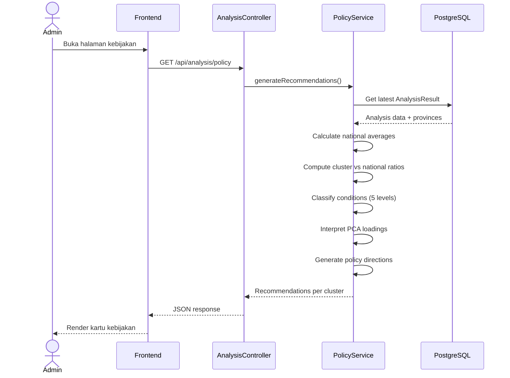

### 4.5 Manajemen User

_Ref: Use Case — Manajemen Sistem `<<include>>` Manajemen User_

> **Keterangan:** Superadmin melakukan operasi CRUD user melalui UserController. Pada **Create**: validasi field + password strength, cek duplikat, hash password, generate UUID/code, simpan. Pada **Update**: cari user, cek proteksi last superadmin. Pada **Delete**: cari user, cek last active superadmin, hapus. Setiap operasi memerlukan autentikasi JWT dan role superadmin.

```mermaid
sequenceDiagram
    actor SA as Superadmin
    participant FE as Frontend
    participant CTRL as UserController
    participant DB as PostgreSQL

    SA->>FE: Kelola user

    rect rgb(40, 40, 60)
    Note over SA,DB: Create User
    SA->>FE: Isi form user baru
    FE->>CTRL: POST /api/users
    CTRL->>CTRL: Validate + check duplicate
    CTRL->>CTRL: Hash password
    CTRL->>DB: INSERT INTO users
    DB-->>CTRL: User created
    CTRL-->>FE: 201 Created
    end

    rect rgb(40, 60, 40)
    Note over SA,DB: Update User
    SA->>FE: Edit data user
    FE->>CTRL: PUT /api/users/:id
    CTRL->>DB: Find user by id
    DB-->>CTRL: User row
    CTRL->>CTRL: Check last superadmin protection
    CTRL->>DB: UPDATE user
    CTRL-->>FE: 200 Updated
    end

    rect rgb(60, 40, 40)
    Note over SA,DB: Delete User
    SA->>FE: Hapus user
    FE->>CTRL: DELETE /api/users/:id
    CTRL->>DB: Find user by id
    DB-->>CTRL: User row
    CTRL->>CTRL: Check last superadmin protection
    CTRL->>DB: DELETE FROM users
    CTRL-->>FE: 200 Deleted
    end
```

---

## 5. Class Diagram

> **Keterangan:** Backend terdiri dari **4 model** ORM: User (auth + role hierarchy user→admin→superadmin), Dataset (versioning + checksum SHA-256), Province (7 indikator sosial-ekonomi per provinsi per tahun), AnalysisResult (output PCA + K-Means dalam JSON). **2 service**: AnalysisService (pipeline analisis) dan PolicyService (generator rekomendasi). Relasi: User uploads Dataset, Dataset contains Province dan produces AnalysisResult.

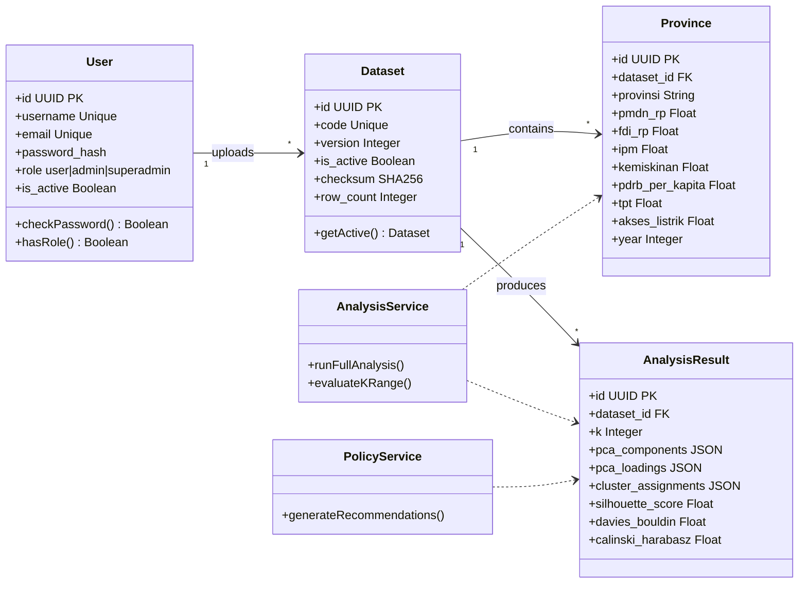

---

## 6. Database Diagram (ERD)

> **Keterangan:** 4 tabel PostgreSQL 16. **users** menyimpan autentikasi (4 UNIQUE, role CHECK). **datasets** mengelola versioning + checksum (FK→users SET NULL). **provinces** menyimpan 7 indikator per provinsi per tahun (6 CHECK, FK→datasets CASCADE). **analysis_results** menyimpan output PCA + K-Means dalam JSON (FK→datasets CASCADE).

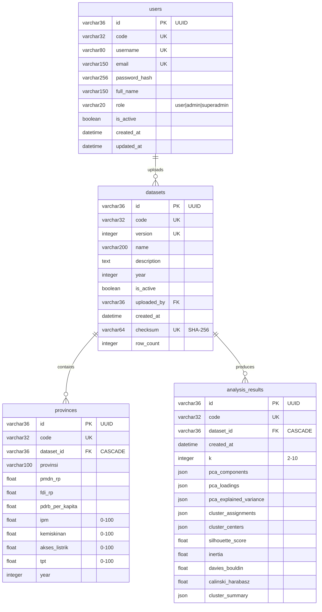
